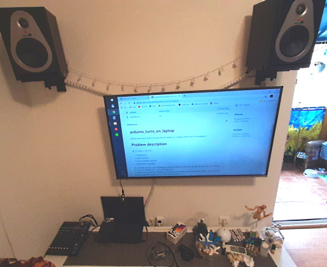

# arduino_turns_on_laptop
Arduino and servo motor to press the On button on a laptop when the TV is turned on

# Problem description

My TV setup is like this:
1. TV Panasonic
2. Mixer Yamaha
3. Active Speakers Samson
4. Old Lenovo ThinkPad

  
My wife likes to press only one button to make things work. She does not want to press the "On" button on 5 devices. Neither do I. I can understand that.  
Incredibly enough the first 3 devices can be turned on and off just with the power socket.
I have a "smart" power socket with remote control over 433MHz similar to [this](  
https://www.amazon.it/deleyCON-prese-radio-Bianco-230-00V/dp/B074VV3T91/ref=pd_day0_79_1/258-7752702-2003723?_encoding=UTF8&pd_rd_i=B074VV3T91&pd_rd_r=bfca3e6c-c195-4fac-bd37-163603320a3d&pd_rd_w=jjQo3&pd_rd_wg=xFWr9&pf_rd_p=7d5a19b1-29b8-4833-bb91-8b454e183d9f&pf_rd_r=HN8XDY11J2Y5AQQVX8ZQ&psc=1&refRID=HN8XDY11J2Y5AQQVX8ZQ).  

ok. I am hoarding them. Don't judge.  

Great! I can use the remote with only one button on/off.  
But the laptop is the exception. I need to press the "On" button manually. Some laptop have the option in BIOS to "turn on when plugged", but not this model.  
That was too much for my wife. Two buttons. No go...  

## Arduino

I am not very good in electronics, I am a programmer. I will not work with transistors, relays, resistors and capacitors. I prefer a microcontroller like Arduino or a mini PC like RaspberryPi. I feel lucky it is all very affordable.  
There are cheaper clones of Arduino and I bought the Smraza kit for 30€ with the microcontroller, servo motor and a bunch of other components. Great.  
I connected the arduino uno clone to my TV USB port. So when the TV starts the port starts the microcontroller. A small program controls the servo motor to press the "On" button of the laptop. Easy.
Everything together is connected the "balkan way" with a lot of duct tape, wires hanging around and a lead weight to achieve the force of pressure needed. Balkan people will understand.  
Watch it in action on youtube: [LF2020-10-02 Arduino turns on laptop](https://www.youtube.com/watch?v=VJjaTkirXVo)

## Why oh why

It all sounds so perfect in my fantasy. But oh reality is a mess. The servo motor involuntary moves when it is attached (turned on) before any voluntary commands of mine are sent to him. You can see that first movement clearly in the youtube video. Try and error to achieve a not-so-perfect solution that looks completely unreliable and it could break at any time. I didn't find a solution yet. But I found a lot of people fighting the same problem. Why is that so hard to achieve? Just don't move until I command you so. What part is not understandable here? 

## And that's it

One button on the remote control to turn on 5 devices. The sound of the servo id funny, but not too much noisy.  
The near button on the remote to turn everything off.  
Unfortunately sometimes the Win 10 does not like to be unplugged so unpolitely and the next time it asks to check the disk or other recovery methods. But it is an SSD disk, so I don't expect any real problems. I just choose "restart the PC". And it all works. It happens very rare thought.

## Development

Install the arduino IDE 1.8.13 (Win,Mac,Linux): [arduino software](https://www.arduino.cc/en/Main/Software).  
In `Tools-Board` I choose the "Arduino Uno".  
There are a great collection of simple examples to start learning with ease.  
The word "sketch" is used for arduino programmes. It uses a C like language with libraries for interaction with components. The microcontroller is usually programmed in an infinite loop. The 2 classic sections of any "sketch" is the setup() and the loop() functions. The sketch file extension is ".ino".  
My sketch is executed only once, after that I put the microcontroller to sleep. That is pretty unusual, though.   
The servo motor needs time to rotate and the sketch needs to use delay() to wait for the movement in the real world.  
Use the "Upload" button to compile and transfer the sketch to the microcontroller. It starts the execution immediately. It will store the sketch and start it every time the microcontroller is plugged in. Or it will restart the sketch after pressing the "Reset" button on the Arduino board.  

## Rust

I plan to do the same programme in Rust. Some knowledge is here: <https://dev.to/creativcoder/how-to-run-rust-on-arduino-uno-40c0>  
I don't want to change my existing programming environment for Rust. I will try to use a docker image exclusively for Arduino programming.  
<https://github.com/Rahix/avr-hal>  

